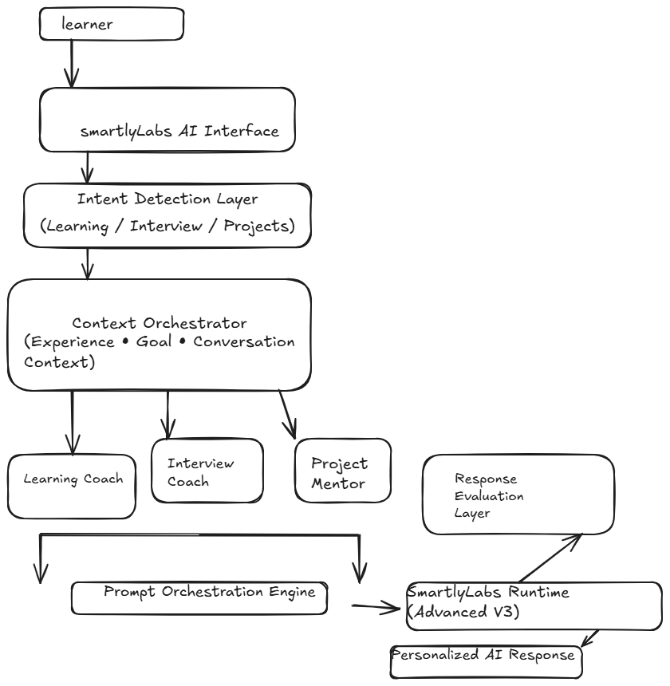
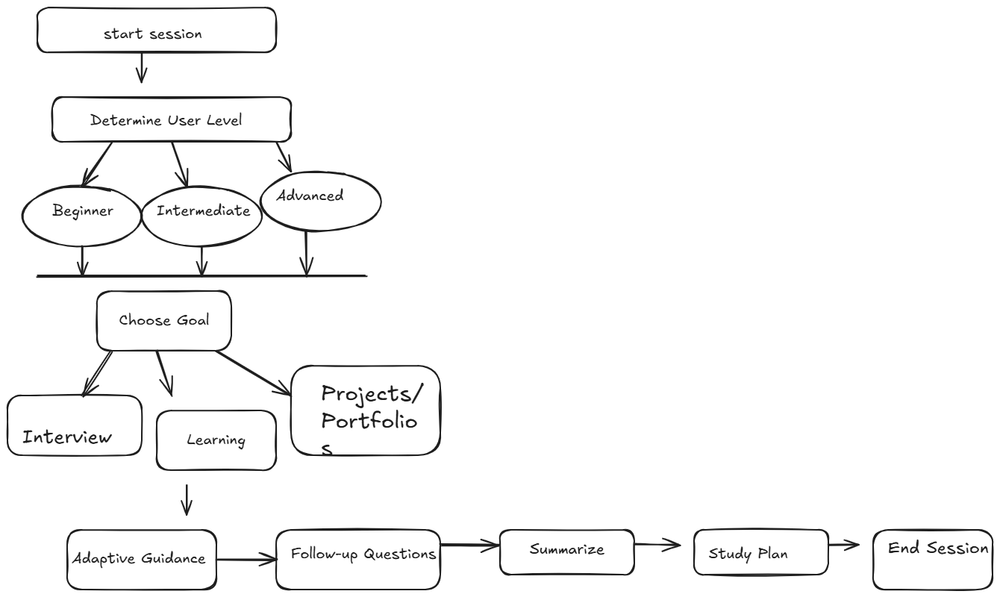
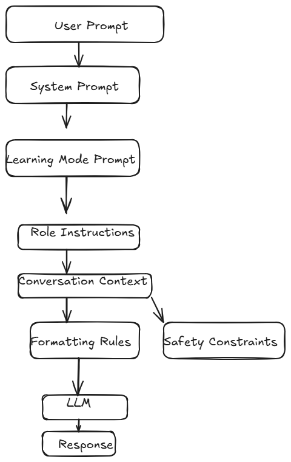
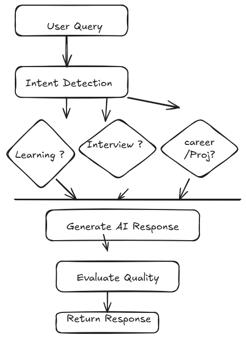
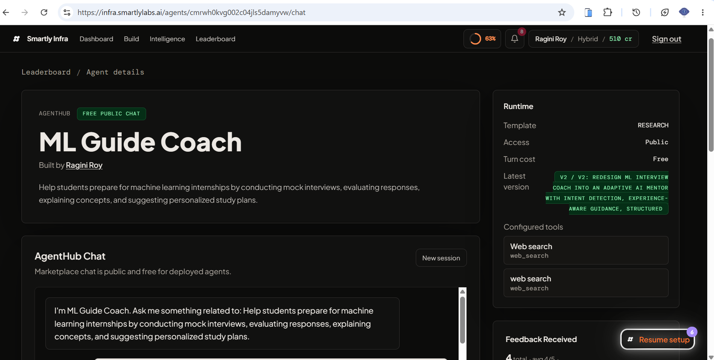
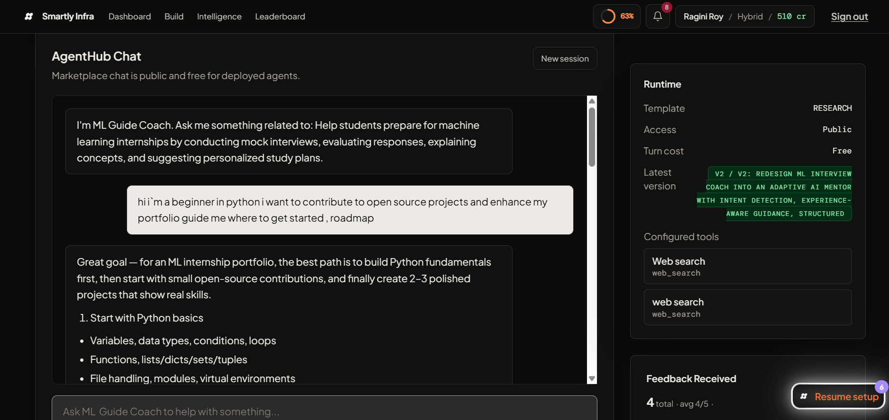

<div align="center">

# 🤖 AI/ML Guide Coach Agent

### An Adaptive AI Mentor for Machine Learning Education, Interview Preparation & Career Development

[]()
[]()
[]()
[]()

Designed and deployed using the **SmartlyLabs AI Platform**.

</div>

---

## Overview

AI/ML Guide Coach is an adaptive educational AI agent that helps aspiring Machine Learning engineers learn concepts, prepare for interviews, and receive personalized study guidance. Unlike a static chatbot, the agent dynamically identifies user intent and routes the conversation into specialized coaching workflows — combining structured prompt engineering, adaptive learning strategies, workflow orchestration, and contextual guidance to deliver a personalized experience.

---

## Problem Statement

Learning Machine Learning often involves fragmented resources, inconsistent interview preparation, and generic AI assistants that fail to adapt to a learner's background. This project addresses that by providing:

- Personalized learning guidance
- AI-powered mock interviews
- Adaptive explanations
- Experience-aware coaching

---

## Key Features

- Adaptive Learning Mode
- Mock Interview Simulation
- AI/ML Concept Explanations
- Experience-aware Guidance
- Personalized Study Roadmaps
- Dynamic Follow-up Questions
- Prompt Engineered Responses
- Structured Educational Workflows

---

## System Architecture

<p align="center">
  
</p>

## Agent Workflow

<p align="center">
  
</p>

## Adaptive Decision Pipeline

<p align="center">
  
</p>

```text
User Query
   │
   ▼
Intent Classification
   │
   ▼
Mode Selection Engine
   │
   ├─────────────┐
   ▼             ▼
Learning     Interview
   │             │
   └──────┬──────┘
          ▼
  Prompt Orchestrator
          ▼
  SmartlyLabs Runtime
          ▼
  Response Evaluation
          ▼
Personalized AI Response
```

### Internal Decision Workflow

<p align="center">
  
</p>

---

## Prompt Engineering

The agent uses modular prompt engineering instead of a single static prompt. Current prompt modules include:

- System Prompt
- Learning Mode
- Interview Mode

---

## Evaluation Strategy

Every response is evaluated against a set of educational quality criteria:

| Metric | Description |
|---|---|
| Relevance | Matches learner intent |
| Technical Accuracy | Correct AI/ML concepts |
| Adaptiveness | Adjusts to learner level |
| Clarity | Beginner-friendly explanations |
| Follow-up Quality | Logical next questions |
| Educational Value | Encourages understanding |

Interview evaluation specifically follows this loop:

```text
Question → Candidate Answer → Evaluation → Follow-up → Feedback
```

---

## Technology Stack

| Category | Technology |
|---|---|
| AI Runtime | SmartlyLabs |
| LLM | OpenAI GPT |
| AI Design | Prompt Engineering |
| Workflow | Workflow Automation (web search, Telegram, hooks) |
| Context | Knowledge Retrieval |

---

## Sample Outputs

### Home Page
<p align="center">
  
</p>

### Learning Mode
<p align="center">
  
</p>

---

## Demo Videos

- **Interview Mode:** [Watch Video](https://drive.google.com/file/d/1aT9jTqvuScVEFfDuHvelB7BZyQBKhWa1/view?usp=sharing)
- **Complete Demo:** [Watch Folder](https://drive.google.com/drive/folders/1ph07UItSgmnK8v4QmBW-lhMVEMaK6Nhc?usp=sharing)

---

## Development Notes

Built iteratively across 4 versions (v1–v4). Structured feedback from 5 real users at v2 was used to guide subsequent tuning, localization, and refinement through final deployment.

**Current capabilities:**
✅ Adaptive Learning &nbsp;·&nbsp; ✅ Interview Simulation &nbsp;·&nbsp; ✅ Prompt Orchestration &nbsp;·&nbsp; ✅ Personalized Study Plans &nbsp;·&nbsp; ✅ Experience Detection

---

## Planned Improvements

- FastAPI backend
- Vector Database + Retrieval-Augmented Generation (RAG)
- LangChain integration
- Persistent memory across sessions

---

## License

MIT License